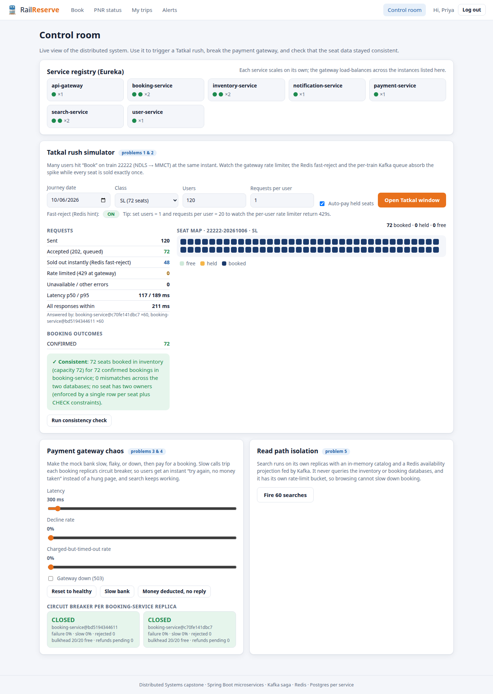
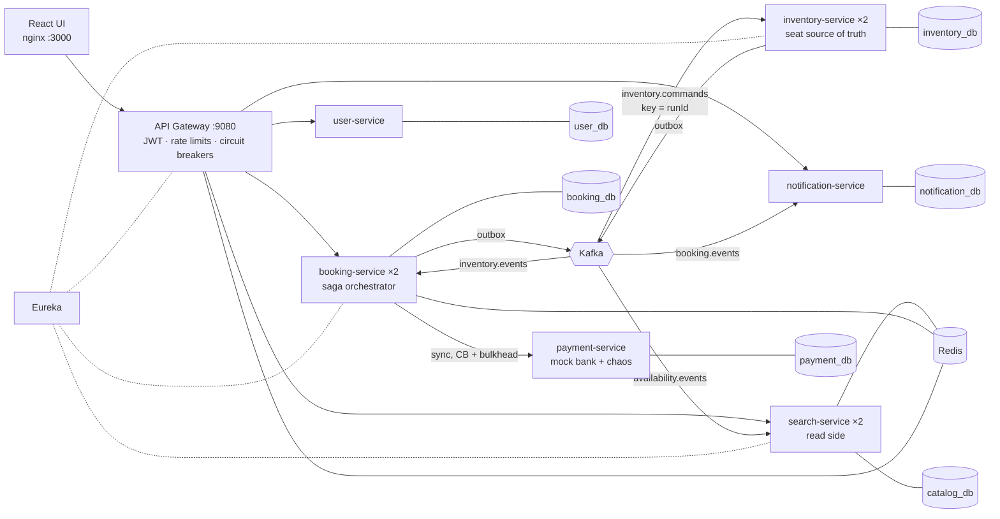

# RailReserve: a distributed railway reservation system

A distributed-systems capstone modelled on IRCTC. The project is a full-stack Java 21 / Spring Boot 3 microservice application with a React UI. It targets the five failure modes that make Indian railway booking hard:

| # | Problem | What this system does about it | Where |
|---|---------|--------------------------------|-------|
| 1 | **Tatkal rush**: thousands press "Book" on the same train at the same minute | Three layers shape the load before it reaches a database. (1) A **gateway token bucket** per user. (2) A **Redis fast-reject**: an atomic Lua check of `available - in-flight`. (3) **Asynchronous 202 + a per-train Kafka queue**, keyed by `runId`. A spike becomes a short queue instead of thousands of blocked threads. | `api-gateway` `RateLimitConfig`, `booking-service` `SeatHints`, `BookingService.create` |
| 2 | **Seat contention**: double booking, or everything serialised behind one lock | Each seat is **one row** with a single `booking_id` column plus `CHECK` constraints, so two owners cannot be represented. Allocation is one `UPDATE … FROM (SELECT … FOR UPDATE SKIP LOCKED)`. Commands for a train are ordered by its Kafka partition, so different trains are allocated in parallel. | `inventory-service` `SeatInventory`, `V1__inventory.sql` |
| 3 | **Payment ambiguity**: money deducted, ticket not booked | Every payment outcome is classified as `Succeeded`, `Declined`, `NotAttempted` or `Unknown`. On `Unknown` the booking goes to `PAYMENT_UNKNOWN`, keeps its seats, and a **reconciler** asks the gateway what really happened. It then confirms, or releases the seats. Paid but the seats were lost? An **automatic refund**. Idempotency keys stop double charges. | `booking-service` `PaymentClient`, `Reconciler`, `payment-service` |
| 4 | **Cascading failure**: a slow bank drags everything down | **Circuit breaker + bulkhead + 3 s timeout** around the payment call (Resilience4j), and gateway circuit breakers with fallbacks on every route. A slow bank costs payers an instant "retry, no money taken" message; search and booking keep working. Notifications are asynchronous and off the critical path. | `booking-service` `application.yml`, `api-gateway` `FallbackController` |
| 5 | **Mixed workloads**: browsing starves booking | **CQRS**. `search-service` runs separate replicas with an in-memory catalog and a **Redis availability projection fed by Kafka**. It never touches the inventory or booking databases, and has its own rate-limit bucket. Availability may be a few seconds stale; the UI says so, and the truth is re-checked at booking. | `search-service` `AvailabilityProjection`, `Catalog` |



---

## Architecture



| Service | Owns | Notes |
|---------|------|-------|
| `discovery-server` | (none) | Eureka. Tuned for a laptop: dead instances disappear in about 15 s |
| `api-gateway` | (none) | Spring Cloud Gateway. Validates the JWT once and sets `X-User-Id` (clients cannot forge it). Has separate Redis token buckets for browsing and booking (keyed by route + user, so one cannot drain the other), plus a circuit breaker and fallback per route |
| `user-service` | `user_db` | Register and login (BCrypt), issues HS256 JWTs |
| `search-service` ×2 | `catalog_db` | Stations, trains, routes and fares, held in memory. Builds the availability projection in Redis from Kafka |
| `inventory-service` ×2 | `inventory_db` | **The only writer of seat state.** Hold, confirm, release, lease reaper, availability events |
| `booking-service` ×2 | `booking_db` | The booking state machine (saga), outbox, fast-reject, payment client, reconciler |
| `payment-service` | `payment_db` | Mock bank. Idempotent per booking. Runtime chaos knobs: latency, decline rate, "charged but timed out", down |
| `notification-service` | `notification_db` | Consumes `booking.events` and stores SMS-style alerts. Deliberately non-critical |

Every service has its own database (shown as six databases in one Postgres container to keep the laptop footprint small). No service reads another service's data. Cross-service communication goes only through HTTP or Kafka.

### Booking saga


States: `PENDING → SEATS_HELD → PAYMENT_PROCESSING → (PAYMENT_UNKNOWN) → CONFIRMING → CONFIRMED`. The terminal failure states are `REJECTED`, `PAYMENT_FAILED`, `EXPIRED`, `CANCELLED` and `FAILED` (refunded). Every transition is a guarded `UPDATE … WHERE status IN (…)`, so Kafka consumers, the pay endpoint, the reconciler and both replicas can race safely. The full timeline of each booking is shown in the UI.

### Reliability patterns

* **Transactional outbox** (`common/messaging/Outbox`). A state change and its outgoing event commit in one transaction. The publisher uses `FOR UPDATE SKIP LOCKED`, so replicas never double-send.
* **Idempotent consumers** (`processed_message`). Kafka is at-least-once, and a redelivered message is a no-op.
* **Idempotency keys** on `POST /bookings` and one payment per booking (a `UNIQUE` constraint), so retries never duplicate bookings or charges.
* **Leases.** Seat holds expire (default 180 s), and a reaper on every inventory replica (`SKIP LOCKED`) returns them to the pool.
* **Dead-letter topics.** A poison message is retried with backoff, then parked on `<topic>.DLT`.
* **Degraded modes.** If Redis is down, search still shows timetables and fares, while fast-reject and the rate limiter fail open. If notifications are down, bookings still confirm and alerts drain later. If the bank is slow, the breaker opens and payments fail fast.

---

## Running it

Prerequisite: **Docker with Compose v2**. Nothing else is needed: Java, Maven and Node builds run inside Docker.

```bash
docker compose up -d --build --wait      # first build takes a few minutes
# then browse to http://localhost:3000 and register any account
```

| URL | What |
|-----|------|
| http://localhost:3000 | Web UI: search, book, pay, trips, alerts, **Control room** |
| http://localhost:9080 | API gateway (all APIs under `/api/...`) |
| http://localhost:9761 | Eureka dashboard |
| http://localhost:3001 | Grafana (after `docker compose --profile observability up -d`) |
| http://localhost:9090 | Prometheus (same profile) |

Ports can be changed with `UI_PORT`, `GATEWAY_PORT`, `EUREKA_PORT`, `GRAFANA_PORT` and `PROMETHEUS_PORT`. Replica counts can be changed with `SEARCH_REPLICAS`, `BOOKING_REPLICAS` and `INVENTORY_REPLICAS`. The hold time is set by `HOLD_SECONDS` and booking rate limits by `RATELIMIT_BOOKING_RATE` / `RATELIMIT_BOOKING_BURST`. Postgres, Redis and Kafka are not published to the host.

To reset all data: `docker compose down -v`.

Footprint: 15 containers (17 with the observability profile), about 4.5 GB RAM.

### Seed data

There are 15 stations and 7 trains (Rajdhani, Shatabdi, superfast and a small **22222 "Tatkal Rush Demo Express"** with 72 SL and 64 3A seats). Runs open daily for the next 15 days (IST). Search and inventory each seed their own database from `common/src/main/resources/seed/railway-seed.json`.

---

## Demo script (viva)

The full runbook, with the terminal commands that back up every UI claim and likely viva questions, is in **[docs/DEMO.md](docs/DEMO.md)**. The short version:

1. **Normal booking.** Search Delhi → Bhopal, pick a class, book. The page shows the 202-then-poll flow: *Queued → Seats held (with countdown) → Pay → Confirmed*, plus the saga timeline.
2. **Tatkal rush (problems 1 and 2).** Open the Control room and click *Open Tatkal window* (120 users, 1 request each). About 72 are queued, the rest get an instant "sold out" from Redis, the seat map fills, and the consistency check shows ✓. Set *Users = 1, Requests per user = 20* to watch the gateway return 429s. Turn fast-reject off and repeat: the outcome is still correct, but every request now costs a DB row, a Kafka message and an inventory transaction.
3. **Money deducted, no reply (problem 3).** Click *Money deducted, no reply*, then book and pay. The booking shows `PAYMENT_UNKNOWN` ("do not pay again"); a few seconds later the reconciler finds the charge and the ticket is confirmed. Cancel it to see the refund in Alerts.
4. **Slow bank (problem 4).** Click *Slow bank* and pay for a few bookings. The first calls time out (→ reconciled), then the replica's breaker turns **OPEN** and further payments fail in milliseconds with "no money taken, seats still held". Search is unaffected. *Reset to healthy*: the breaker goes half-open, then closed.
5. **Read path isolation (problem 5).** Click *Fire 60 searches*: they are spread across both search replicas, at single-digit milliseconds.
6. **Kill things.** Run `scripts/chaos.sh kill-inventory` during a rush, then `scripts/check-consistency.sh`. Also try `stop-redis`, `stop-notification` and `restore`.

---

## Testing and evidence

| What | Command | Shows |
|------|---------|-------|
| Seat allocation concurrency tests (Testcontainers, real Postgres) | `./mvnw -pl inventory-service -am test` | 300 threads racing for 50 seats, both with `SKIP LOCKED` and with a plain `FOR UPDATE`: exactly 50 winners and no seat with two owners; multi-seat requests are all-or-nothing; expired holds are reaped and rebookable; confirm/release are idempotent |
| Tatkal spike load test (k6) | `scripts/loadtest.sh` (`USERS=1000 BROWSE_RPS=200 …`, `FAST_REJECT=off`) | Spike plus background searches, every winner pays, then the consistency check below |
| Cross-database invariants | `scripts/check-consistency.sh [runId]` | No seat sold twice, never above capacity, inventory ⇔ booking agree, no charge without a ticket (or refund), no confirmed ticket without a charge, no stuck sagas, no un-reaped holds |
| Failure injection | `scripts/chaos.sh <scenario>` | See the script header |
| Follow one booking everywhere | `scripts/trace-booking.sh <PNR>` | The booking's rows in 4 databases, its Kafka messages with partitions, and the log lines showing which replica did each step |
| Prove the problem is real | Control room: *Seat allocator → NAIVE*, or `ALLOCATION=naive scripts/loadtest.sh` | A deliberately broken allocator (read, then write; no locks; no per-train order). In testing it sold **120 confirmed tickets for 72 seats** (one seat on 12 PNRs); the check script fails. SAFE mode: exactly 72, all PASS |
| Browser UI test (26 steps) | `python3 scripts/ui-test/ui_e2e.py` (needs `chromium`) | Registers, logs in, searches, books 2 passengers, pays, cancels and gets a refund, releases seats, checks PNR, alerts, payment chaos ("verifying" and "gateway down"), sliders, fast-reject toggle, both simulators, consistency check, mobile layout. Fails on broken flows and lists console and HTTP errors |

### Measured results

The test machine was an Intel i5-13450HX (16 threads) with 22 GB RAM; everything ran on one laptop in Docker. The numbers show relative behaviour, not production capacity.

| Scenario | Result |
|----------|--------|
| 500 users book the 72 SL seats of 22222 at the same instant, plus 100 searches/s | 72 queued, **428 rejected instantly by Redis**, **0 errors**; ack p95 518 ms; all 72 confirmed and paid; every invariant passes |
| Same, with fast-reject **off** | All 500 queued; inventory confirmed exactly 72 and rejected 428 in arrival order; still 0 errors and consistent. The fast-reject saves 428 DB writes, Kafka messages and inventory transactions |
| 600 users plus 150 searches/s | 80 admitted by the hint (the hint is approximate), inventory confirmed 72 and rejected 8; **search p95 5 ms during the spike** |
| 1,000 users plus 200 searches/s (fresh stack) | 80 queued, 920 rejected instantly, **0 errors**; ack p95 1.15 s; 72 confirmed, 8 rejected by inventory; search p95 7 ms; every invariant passes |
| Kill an inventory replica 1 s into a 400-user spike | 0 errors, 72 confirmed, all invariants pass; the saga finished about 12 s later (Kafka session timeout lowered from 45 s to 10 s) |
| Payment gateway at 2.5 s latency | After 5 slow calls the replica's breaker opened; further payments got an instant 503 (~15 ms) with seats kept |
| Payment "charged but timed out" | `PAYMENT_UNKNOWN` → reconciled to `CONFIRMED` within about 6 s; cancel → refund completed |
| Redis stopped | Search answers with timetables and fares ("check at booking"); bookings accepted; full recovery when Redis returns |
| Notification service stopped | Bookings confirm; the gateway returns a clean 503 for alerts; queued alerts are delivered after restart |

---

## Design decisions and trade-offs (for the report)

* **CP for seats, AP for search.** Inventory rejects or delays rather than risking a double booking. Search serves a projection that may be a few seconds stale, and the UI shows its age.
* **The Redis counter is a hint, not the truth.** It can admit a few extra requests (the 80-vs-72 case above), which inventory then rejects. It can never cause an oversell. If Redis is lost, the system becomes slower, not wrong.
* **Ordering beats locking.** Keying `inventory.commands` by `runId` puts one train's requests on one partition and one consumer, so hot-train requests queue in Kafka instead of fighting over row locks. `SKIP LOCKED` keeps throughput up when two allocators do meet (during a rebalance, or for the reaper).
* **Payment is synchronous; seats are asynchronous.** The user is waiting for the bank anyway, so a bounded synchronous call (3 s, breaker, bulkhead) gives the clearest UX, and every ambiguous outcome is handed to the reconciler. Seat allocation is where the spike lands, so it goes through Kafka.
* **Per-replica circuit breakers.** Each booking replica learns about the bank independently, as in production. The Control room shows both.
* **Static reference data is replicated, not called.** Booking prices and validates from the shared seed catalog, so the write path does not depend on search being up.

### Simplifications and out of scope

* A seat is booked for the whole run, not per segment (no leg-level allocation), and there is no waitlist or RAC.
* One Kafka broker (RF 1) and one Postgres container hosting six databases. The 3-broker / replica setup described in the spec would be a compose override.
* The payment gateway is a mock. There is no real bank, captcha or bot defence, and the admin endpoints are protected only by login.

## Project layout

```
common/                shared event contracts, outbox, idempotency helper, seed catalog
discovery-server/      Eureka
api-gateway/           routing, JWT, rate limits, circuit breakers, fallbacks
user-service/          accounts and JWT
search-service/        catalog + availability projection (read side)
inventory-service/     seats, holds, reaper (source of truth) + concurrency tests
booking-service/       saga orchestrator, fast-reject, payment client, reconciler
payment-service/       mock bank with chaos controls
notification-service/  alerts from booking events
frontend/              React (Vite) UI served by nginx
loadtest/tatkal.js     k6 spike scenario
scripts/               loadtest, consistency check, chaos
infra/                 postgres init, prometheus, grafana dashboard
```
